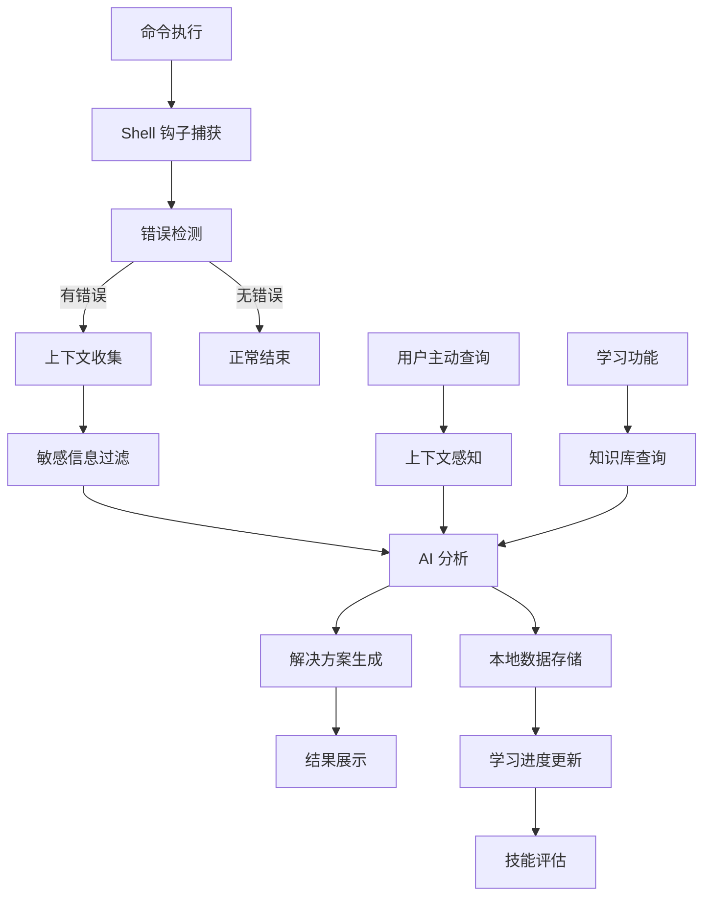

# 常见问答

本文档回答了用户最常问的问题，帮助您深入了解 AIS 的设计理念、使用价值和最佳实践。

## 🌟 项目愿景与设计哲学

### AIS 的设计初衷是什么？

AIS (AI Shell) 诞生于一个朴素的理念：**让每个人都能从错误中高效学习，将失败转化为成长的动力**。

我们观察到，在日常工作中：
- 开发者经常遇到相同的错误，但缺乏系统性的学习机制
- 新手面对错误信息往往感到困惑，不知道从何入手解决
- 经验丰富的工程师也会因为知识盲区而在某些问题上反复踩坑
- 传统的搜索引擎虽然能提供答案，但缺乏个性化和上下文感知

AIS 的核心理念是：**错误不是障碍，而是最好的学习机会**。通过 AI 技术将错误分析、问题解决和知识学习无缝整合，让每次失败都成为技能提升的阶梯。

### AIS 的设计理念有哪些？

#### 1. **上下文感知优先**
不同于传统工具的通用化回答，AIS 深度理解你的工作环境：
- 自动收集系统信息、项目结构、Git 状态
- 根据你的技能水平提供个性化建议
- 考虑当前工作场景给出针对性解决方案

#### 2. **无侵入式集成**
我们相信最好的工具是"隐形"的：
- 与现有工作流程无缝融合，不改变使用习惯
- 通过 Shell 钩子机制自动捕获错误，无需手动操作
- 后台智能分析，不干扰正常的命令执行

#### 3. **渐进式学习**
从被动的错误修复到主动的技能提升：
- 错误分析 → 问题解决 → 知识理解 → 技能内化
- 个性化学习路径，根据你的错误模式推荐学习内容
- 长期追踪学习进度，可视化技能成长轨迹

#### 4. **AI 增强的人机协作**
AI 不是替代人类思考，而是放大人类的学习能力：
- 快速定位问题根因，节省故障排除时间
- 提供多种解决方案，培养解决问题的思维
- 深层知识解析，帮助理解"为什么"而不仅是"怎么做"

#### 5. **隐私与安全第一**
在 AI 时代保护用户隐私：
- 所有数据本地存储，用户拥有完全控制权
- 支持完全离线的本地 AI 模型
- 自动过滤敏感信息，可配置的隐私保护级别
- 透明的数据使用政策，用户知情同意

### AIS 相比其他工具的独特价值是什么？

| 对比维度 | 传统搜索引擎 | Stack Overflow | AI 助手(ChatGPT) | AIS |
|---------|-------------|---------------|------------------|-----|
| **上下文理解** | ❌ 通用化回答 | ❌ 需要手动描述 | ⚠️ 有限的上下文 | ✅ 深度环境感知 |
| **学习追踪** | ❌ 无学习记录 | ❌ 分散的知识 | ❌ 无个人档案 | ✅ 系统化学习追踪 |
| **自动化集成** | ❌ 需要手动查询 | ❌ 需要手动提问 | ❌ 需要手动输入 | ✅ 自动错误捕获 |
| **个性化程度** | ❌ 千人一面 | ⚠️ 基于投票热度 | ⚠️ 对话内个性化 | ✅ 基于历史和技能 |
| **隐私保护** | ❌ 搜索记录上传 | ❌ 公开提问 | ❌ 对话数据训练 | ✅ 本地化+可选云端 |

## 🎯 目标用户与使用场景

### 谁最适合使用 AIS？

#### 1. **开发新手和学生** 🎓
- **痛点**：面对错误信息茫然无措，不知道从何入手
- **AIS 价值**：
  - 将复杂的错误信息转化为易懂的解释
  - 提供循序渐进的解决步骤
  - 建立系统化的知识体系，而不是碎片化学习
  - 可视化学习进度，增强学习成就感

**真实案例**：某计算机专业大一学生使用 AIS 三个月后，Docker 容器操作错误率从 85% 降低到 20%，并且能够独立解决 Git 合并冲突问题。

#### 2. **经验丰富的开发者** 💼
- **痛点**：虽然技能扎实，但在新技术栈或复杂环境中仍会遇到盲区
- **AIS 价值**：
  - 快速定位不熟悉领域的问题根因
  - 基于丰富经验提供高质量的上下文分析
  - 帮助探索新技术栈，降低学习成本
  - 记录和分享团队常见问题的解决方案

**真实案例**：某高级后端工程师在切换到 DevOps 角色时，使用 AIS 在两周内掌握了 Kubernetes 集群的常见故障排除技巧。

#### 3. **运维和 SRE 工程师** 🔧
- **痛点**：需要快速诊断和解决生产环境问题，时间压力大
- **AIS 价值**：
  - 实时的系统状态感知和智能分析
  - 基于历史故障模式的快速诊断
  - 多维度的系统健康状况分析
  - 形成可复用的故障处理知识库

**真实案例**：某 SRE 团队使用 AIS 后，平均故障解决时间从 45 分钟缩短到 15 分钟，并且建立了包含 200+ 常见问题的智能知识库。

#### 4. **技术团队 Leader** 👨‍💼
- **痛点**：需要提升团队整体技术水平，规范化问题解决流程
- **AIS 价值**：
  - 团队技能水平可视化分析
  - 统一的问题诊断和解决标准
  - 新员工快速上手的学习路径
  - 基于数据的技能培训决策支持

**真实案例**：某创业公司 CTO 使用 AIS 为 10 人技术团队建立了标准化的故障处理流程，新员工上手时间从 3 周缩短到 1 周。

#### 5. **自学者和技术爱好者** 🚀
- **痛点**：缺乏系统性的学习路径，容易迷失在海量的技术资料中
- **AIS 价值**：
  - 个性化的学习路径推荐
  - 实践驱动的学习方式（从解决实际问题中学习）
  - 技能成长可视化，保持学习动力
  - 与实际工作场景结合的深度学习

### 典型使用场景分析

#### 场景 1：日常开发调试 🐛
**情况描述**：在开发过程中遇到各种技术问题

```bash
# 场景：Docker 容器启动失败
$ docker run my-app
Error: failed to create endpoint on network bridge: failed to add the host...

# AIS 自动分析
📊 错误分析完成
📋 问题类型：Docker 网络配置冲突
🔍 根本原因：端口 8080 已被占用，且防火墙规则阻止容器网络访问
💡 解决建议：
1. 检查端口占用：lsof -i :8080
2. 修改容器端口映射：docker run -p 8081:8080 my-app
3. 或终止占用进程：sudo kill $(lsof -t -i:8080)

📚 相关学习：建议学习 "docker" 主题以深入了解容器网络
```

#### 场景 2：生产环境故障排除 🚨
**情况描述**：生产系统出现问题，需要快速定位和解决

```bash
# 场景：服务器性能异常
$ top
# AIS 检测到系统负载异常高

# 主动分析
$ ais ask "系统负载突然升高到 15.0，如何快速定位问题？"

🧠 基于当前环境分析：
💻 系统状态：Linux Ubuntu 20.04, 8核16GB, 当前负载15.23
📊 资源使用：CPU 95%, 内存 89%, 磁盘I/O 高
🔍 异常进程：检测到 mysqld 进程CPU占用 89%

📋 推荐排查步骤：
1. 立即检查数据库慢查询：SHOW PROCESSLIST;
2. 查看最近的查询日志：tail -f /var/log/mysql/slow.log
3. 检查是否有死锁：SHOW ENGINE INNODB STATUS;
4. 临时限制连接数：SET GLOBAL max_connections=50;

⚡ 紧急处理：如果问题持续，建议重启 mysql 服务
```

#### 场景 3：技能学习和提升 📖
**情况描述**：系统化学习新技术或深入理解某个领域

```bash
# 主动学习
$ ais learn kubernetes

🎓 Kubernetes 容器编排学习指南

📚 学习路径：
├── 基础概念（Pod、Service、Deployment）
├── 集群架构（Master/Node 组件）
├── 存储管理（PV、PVC、StorageClass）
├── 网络配置（CNI、Ingress、NetworkPolicy）
├── 监控运维（Prometheus、Grafana）
└── 故障排除（常见问题诊断）

🎯 基于你的历史错误，建议重点关注：
- Pod 调度失败的常见原因
- Service 网络连通性问题
- 存储挂载权限配置

💡 实践建议：
建议先在本地搭建 minikube 环境进行练习
```

#### 场景 4：学生编程学习 🎓
**情况描述**：计算机专业学生在学习过程中遇到的技术问题

```bash
# 场景：Python 作业调试
$ python homework.py
Traceback (most recent call last):
  File "homework.py", line 15, in <module>
    result = divide(10, 0)
  File "homework.py", line 3, in divide
    return a / b
ZeroDivisionError: division by zero

# AIS 自动分析
📊 错误分析完成
📋 问题类型：除零错误 (ZeroDivisionError)
🔍 根本原因：函数 divide() 在第3行尝试用0作除数

💡 解决建议：
1. 添加异常处理：
   def divide(a, b):
       if b == 0:
           return "Error: Cannot divide by zero"
       return a / b

2. 使用 try-except 结构：
   try:
       result = a / b
   except ZeroDivisionError:
       print("除数不能为零")

📚 学习重点：Python 异常处理机制
建议学习：try-except、raise、自定义异常类
```

## 🏗️ 技术架构与设计选择

### 为什么选择 Shell 集成而不是 IDE 插件？

这是一个深思熟虑的设计决策：

#### **Shell 集成的优势**：
1. **环境完整性**：Shell 是最接近实际运行环境的地方，能够捕获真实的系统状态
2. **工具无关性**：无论你使用 vim、VS Code、IntelliJ 还是其他编辑器，都能获得一致的体验
3. **系统级视角**：能够收集完整的系统信息、环境变量、进程状态等上下文
4. **实时性**：在问题发生的第一时间进行捕获和分析

#### **与 IDE 插件的对比**：
```
IDE 插件方式：代码编写 → 编译/运行 → 切换到终端 → 出现错误 → 回到 IDE → 查看错误
AIS Shell 集成：代码编写 → 运行命令 → 错误捕获 → 即时分析 → 解决方案
```

### AIS 的数据流架构是怎样的？



### 为什么支持多种 AI 提供商？

#### **技术多样性**：
- **OpenAI GPT**：综合能力强，API 稳定，适合日常使用
- **Anthropic Claude**：推理能力突出，安全性好，适合复杂分析
- **本地模型 (Ollama)**：完全离线，隐私保护，适合敏感环境
- **自定义模型**：企业内部模型，满足特殊需求

#### **风险分散**：
- 避免单一供应商依赖
- 服务中断时的备用方案
- 成本控制和优化选择

#### **用户选择权**：
不同用户对隐私、成本、性能的需求不同，多供应商支持让用户根据实际情况灵活选择。

## 🆚 与竞品对比分析

### AIS vs. 传统错误查询方式

#### **Google + Stack Overflow 模式**
```
问题发生 → 复制错误信息 → 搜索引擎查询 → 筛选结果 
→ 阅读多个答案 → 尝试解决方案 → 可能仍需多次尝试
```
**缺点**：时间成本高、缺乏上下文、通用化答案

#### **AIS 模式**
```
问题发生 → 自动捕获 → 上下文分析 → 个性化解决方案 
→ 直接应用 → 知识记录和学习
```
**优势**：自动化、个性化、学习闭环

### AIS vs. GitHub Copilot / CodeWhisperer

| 功能对比 | GitHub Copilot | AIS |
|---------|---------------|-----|
| **核心场景** | 代码编写辅助 | 错误诊断和学习 |
| **触发方式** | 主动编写代码 | 自动错误捕获 |
| **上下文范围** | 当前文件和项目 | 完整系统环境 |
| **学习机制** | 代码建议优化 | 系统化技能追踪 |
| **使用阶段** | 开发阶段 | 调试和运维阶段 |

**互补关系**：Copilot 帮助写代码，AIS 帮助调试代码和系统问题。

### AIS vs. 企业级监控工具

| 对比维度 | Datadog/NewRelic | AIS |
|---------|------------------|-----|
| **目标用户** | 企业运维团队 | 个人开发者+小团队 |
| **部署复杂度** | 高（需要专业配置） | 低（一键安装） |
| **成本** | 高（企业级收费） | 低（开源+可选AI服务） |
| **个性化** | 有限 | 高（基于个人技能） |
| **学习功能** | 无 | 核心功能 |

## 📈 成功案例与用户故事

### 案例 1：计算机专业学生的编程学习助手

**背景**：某大学计算机科学专业大二学生，正在学习数据结构和算法课程

**学习挑战**：
- C++ 指针和内存管理经常出错
- 算法实现时逻辑错误难以定位
- 编译错误信息看不懂

**AIS 使用体验**：
```bash
# 场景：链表实现出错
$ g++ linkedlist.cpp -o linkedlist
linkedlist.cpp:25:5: error: 'Node' was not declared in this scope
linkedlist.cpp:25:10: error: 'head' was not declared in this scope

# AIS 自动分析
📊 编译错误分析
🔍 问题定位：第25行使用了未声明的 'Node' 类型
💡 可能原因：
1. 忘记包含头文件或声明 Node 结构体
2. 作用域问题，Node 定义在其他命名空间
3. 拼写错误，应该是其他类型名

🛠️ 建议解决方案：
1. 检查是否定义了 Node 结构体：
   struct Node {
       int data;
       Node* next;
   };
2. 确认 head 指针的声明：Node* head = nullptr;
```

**学习效果**：
- **编程错误率**：3个月内从日均15个减少到3个
- **调试时间**：平均每个问题从45分钟缩短到10分钟
- **知识掌握**：建立了完整的C++错误处理知识体系
- **自信心提升**：从害怕编程错误到主动尝试新功能

### 案例 2：软件工程实习生的快速成长

**背景**：某软件公司实习生，计算机专业大三学生，第一次接触企业级开发

**实习困难**：
- Linux 命令不熟悉，经常操作错误
- Git 工作流程复杂，合并冲突频繁
- Docker 容器化部署完全陌生

**AIS 实际应用**：
```bash
# 场景：Git 合并冲突处理
$ git merge feature-branch
Auto-merging src/main.py
CONFLICT (content): Merge conflict in src/main.py
Automatic merge failed; fix conflicts and then commit the result.

# AIS 智能指导
🔥 Git 合并冲突检测
📁 冲突文件：src/main.py
🎯 冲突类型：内容冲突 (content conflict)

📋 解决步骤：
1. 打开冲突文件查看标记：
   <<<<<<< HEAD
   当前分支的代码
   =======
   要合并分支的代码
   >>>>>>> feature-branch

2. 手动编辑解决冲突，删除标记符号
3. 添加解决后的文件：git add src/main.py
4. 完成合并：git commit -m "resolve merge conflict"

💡 预防建议：定期 git pull 保持代码同步
```

**成长轨迹**：
- **第1周**：每天遇到20+个操作问题，需要导师指导
- **第2周**：通过AIS学习，独立解决60%的常见问题
- **第4周**：掌握基本Git工作流，能够独立处理合并冲突
- **第8周**：成为实习生中的"技术小达人"，帮助其他同学解决问题

### 案例 3：编程训练营学员的技能突破

**背景**：某在线编程训练营学员，非计算机专业背景，希望转行做前端开发

**学习痛点**：
- JavaScript 异步编程概念模糊
- 前端框架 React 组件开发困难
- 网络请求和错误处理经常失败

**AIS 学习历程**：
```bash
# 场景：React 组件渲染错误
$ npm start
Error: Cannot read property 'map' of undefined
    at UserList (UserList.js:15)
    at renderWithHooks

# AIS 深度分析
📊 React 错误诊断
🔍 错误位置：UserList.js 第15行
💡 问题分析：尝试对 undefined 值调用 map 方法

🎯 常见原因：
1. 异步数据还未加载完成就尝试渲染
2. API 返回数据结构与预期不符
3. 组件 props 未正确传递

🛠️ 解决方案：
1. 添加条件渲染：
   {users && users.map(user => <div key={user.id}>{user.name}</div>)}

2. 设置默认值：
   const users = props.users || [];

3. 添加加载状态：
   {loading ? <div>Loading...</div> : renderUserList()}

📚 学习建议：深入理解 React 生命周期和异步数据处理
```

**6个月学习成果**：
- **从零基础到入门**：掌握 HTML、CSS、JavaScript 基础语法
- **React 技能建立**：能够独立开发中等复杂度的单页应用
- **调试能力提升**：从完全依赖老师到能够独立解决80%的问题
- **成功转行**：获得前端开发实习 offer，月薪 8000+

## 🤔 深度问答

### AIS 如何平衡智能化和用户控制权？

这是我们设计中的核心考量：

#### **渐进式智能**：
1. **新手模式**：提供详细的步骤指导，解释每个操作的原理
2. **进阶模式**：给出多种解决方案，让用户选择最适合的
3. **专家模式**：提供简洁的诊断结果，用户自主决策

#### **透明性原则**：
- 所有 AI 分析都显示置信度和依据
- 用户可以查看完整的上下文收集内容
- 解决方案包含风险提示和副作用说明

#### **可控性保证**：
```bash
# 用户可以完全控制 AIS 的行为
$ ais config --set auto_analysis=false      # 关闭自动分析
$ ais config --set ask.context_level=minimal # 最小化上下文收集
$ ais provider-use ollama                    # 使用本地模型
```

### 如何确保 AIS 给出的建议是安全的？

#### **多层安全机制**：

1. **命令风险评估**：
```bash
# AIS 会对建议的命令进行风险评级
💡 解决方案 [风险等级：中等 ⚠️]
建议执行：sudo rm -rf /tmp/problematic_dir
⚠️ 风险提示：该命令使用 sudo 权限，请确认路径正确
🛡️ 安全建议：先使用 ls -la /tmp/problematic_dir 确认内容
```

2. **用户确认机制**：
对于高风险操作，AIS 会要求明确确认：
```bash
⚡ 检测到高风险操作：sudo systemctl stop database
❓ 该操作将停止数据库服务，可能影响业务，是否继续？
   输入 'YES' 确认执行，或按 Ctrl+C 取消
```

3. **历史操作追踪**：
```bash
# AIS 记录所有建议的操作，支持查看历史
$ ais history 10  # 查看最近10条历史记录
```

### AIS 的学习效果如何量化？

#### **多维度指标体系**：

1. **技能进步指标**：
- **错误率变化**：同类问题的错误频率下降
- **解决时间缩短**：从发现问题到解决的时间趋势
- **独立解决率**：无需查询外部资源的问题比例

2. **知识广度指标**：
- **工具熟练度**：使用的命令和工具种类增长
- **错误类型覆盖**：遇到和解决的问题类型多样性
- **最佳实践采用**：使用推荐方案的频率

3. **可视化报告**：
```bash
$ ais report --html --learning-analytics

📊 30天学习分析报告
├── 技能提升：Docker 熟练度 6.2→8.1 ⬆️
├── 效率改善：问题解决时间平均缩短 65%
├── 知识扩展：新掌握 23 个命令和工具
└── 错误预防：重复性错误减少 78%
```

### 企业环境下如何部署和管理 AIS？

#### **企业级部署方案**：

1. **集中化配置管理**：
```bash
# 企业配置模板
$ ais config --template=enterprise --deploy

# 批量用户配置
$ ais admin --setup-users --from-ldap
$ ais admin --set-policy --privacy=high --data-retention=90
```

2. **团队知识库建设**：
```bash
# 构建企业知识库
$ ais knowledge --import-from="./enterprise-runbooks/"
$ ais knowledge --share-team-solutions
$ ais knowledge --export-wiki --format=confluence
```

3. **安全和合规**：
- 支持企业级身份认证（LDAP/SSO）
- 数据本地化存储，支持审计日志
- 细粒度权限控制和内容过滤
- 符合 GDPR、SOX 等合规要求


## 🔚 结语

AIS 不只是一个工具，更是一种学习理念的体现。我们相信，在 AI 时代，最重要的不是记住所有的知识，而是学会如何高效地学习和解决问题。

**每一次错误，都是成长的机会。**  
**每一次学习，都让我们变得更强。**

让我们一起，将失败转化为智慧，将困惑转化为洞察，在技术的道路上永远保持学习的热情。

---

::: tip 💡 提示
这个 FAQ 会持续更新，如果您有任何问题或建议，欢迎通过 GitHub Issues 与我们交流。
:::

::: info ℹ️ 版本信息
当前 FAQ 版本基于 AIS v2.5.4，最后更新时间：2025-07-23
:::

::: warning ⚠️ 免责声明
AIS 提供的建议仅供参考，用户应根据实际情况谨慎操作。对于生产环境的操作，建议先在测试环境验证。
:::